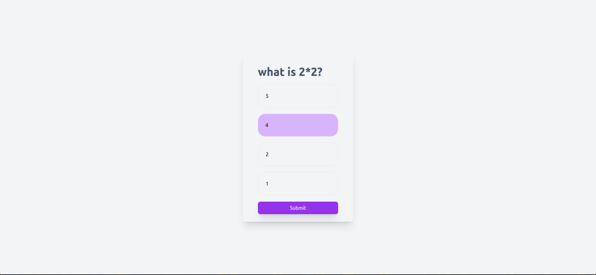
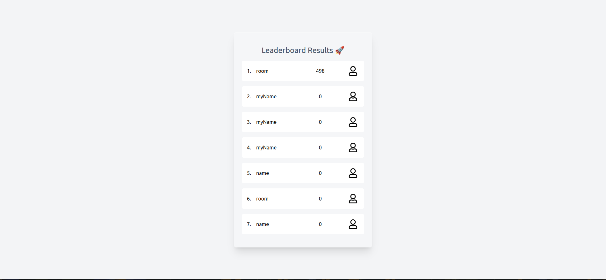

### Build a simple quizzing app similar to menti meter

## Features

- Admin should be allowed to add questions (MCQ, single answer)
- Admin should be allowed to move to the next questions
- Admin should be allowed to show the leaderboard to everyone
- Users should be allowed to answer the questions
- Users just need to poll the server for the next question, no need for it to be realtime

## Preview

#### Home 

#### Create Quest

#### Join Room/Quest

#### Answer Questions

#### Leader Board
